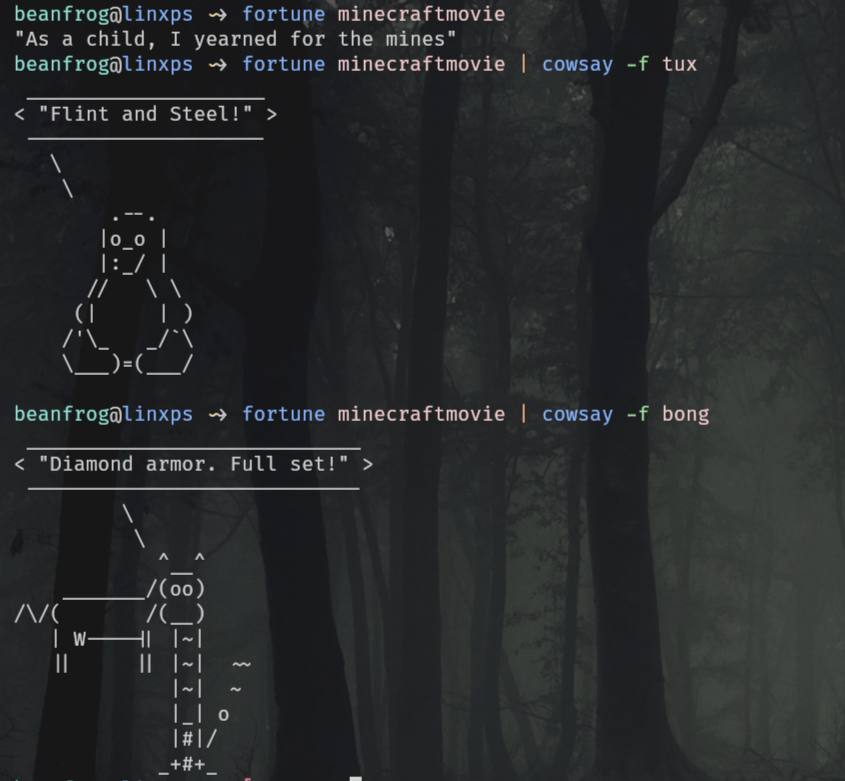

# fortune-mod-minecraft-movie
quotes from A Minecraft Movie (2025) that you can use in the `fortune` command.
## How to use
(assuming you have fortune installed already)
- `cd /usr/share/fortune`
- `wget https://github.com/bean-frog/fortune-mod-minecraft-movie/raw/refs/heads/main/minecraftmovie`
- `wget https://github.com/bean-frog/fortune-mod-minecraft-movie/raw/refs/heads/main/minecraftmovie.dat`
- if you run just the fortune command with no args, it will choose a random fortune file from this directory
- to use only this file, use `fortune minecraftmovie`
- this is incredibly stupid but also kinda funny

## Contributing
- edit the `minecraftmovie` file
- run `strfile -c % minecraftmovie{,.dat}`
- open a PR
